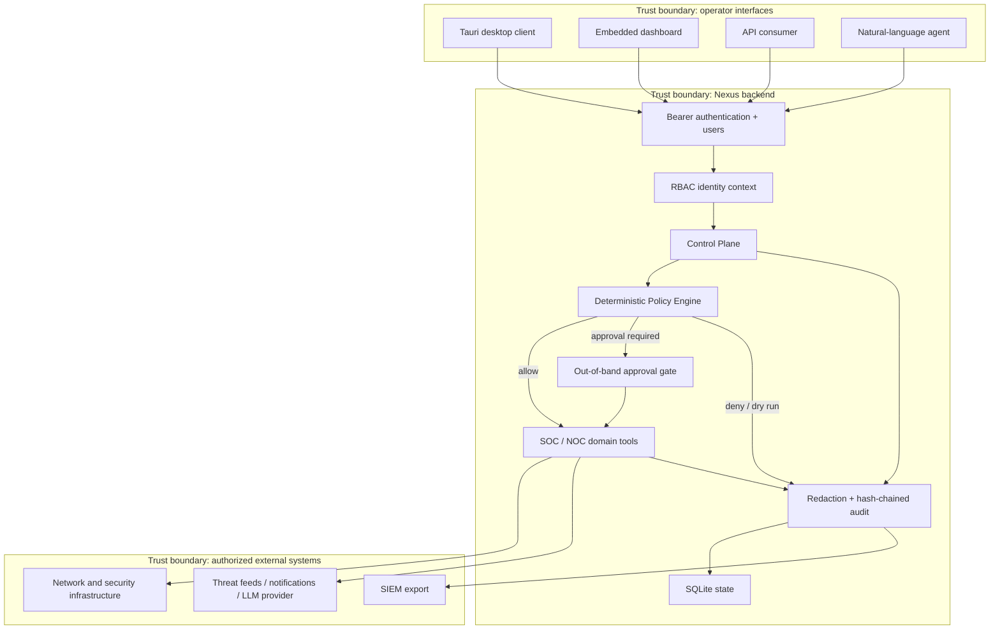

# Nexus Defense AI — Architecture

## System context

Nexus is a modular monolith for an authorized SOC/NOC lab. Interfaces submit
requests to a Python backend; the control plane evaluates sensitive actions; and
domain tools integrate with infrastructure only after policy permits execution.

## Decision path

For a sensitive operation, the policy engine evaluates controls in this order:

1. the authenticated role has the required permission;
2. the target does not match a hard safety prohibition;
3. the capability toggle explicitly enables the operation;
4. any required engagement reference is present;
5. the target is within the authorized asset scope when strict mode is enabled;
6. `lab` or `replay` converts state-changing work to a dry run;
7. high or critical risk requires an out-of-band human approval;
8. only then may the executor run.

Every decision is redacted and added to the audit trail, including denials and
dry runs.

## Major components

| Component | Responsibility | Primary paths |
| --- | --- | --- |
| API | Authentication, permission checks, REST contracts | `api/` |
| Agent runtime | Intent routing and tool orchestration | `agents/` |
| Control plane | Single decision boundary for governed actions | `core/control_plane.py` |
| Policy engine | Deterministic authorization and risk decision | `core/policy_engine.py` |
| Identity | Users, service principals, RBAC, context propagation | `core/users.py`, `core/rbac.py` |
| Operating mode | `lab`, `replay`, and deliberately selected `real` | `core/operating_mode.py` |
| Domain tools | Monitoring, intelligence, response, and NOC actions | `tools/` |
| Persistence | State, incidents, telemetry, and audit chain | `database/` |
| Desktop client | Local operator interface | `clients/tauri/` |

## Security boundaries

### API and client

- The API refuses to start without a configured administrative token.
- Tokens are compared through authenticated principal resolution and are never
  intentionally logged.
- The Tauri client permits only loopback HTTP on port 8000 and keeps its token in
  session storage.
- Remote access requires a separately designed TLS reverse proxy or secure
  tunnel; it is not enabled by the desktop capability.

### Secrets and sensitive data

- Runtime secrets are resolved through the OS secret backend first, with `.env`
  reserved for local development.
- Honeypot credentials are encrypted with a dedicated Fernet key before SQLite
  storage. Without a key, values fail safe to a non-reversible redacted marker;
  reports, audit events, and outbound notifications expose only aggregate
  classification rather than raw values.
- The database and local `.env` are restricted to owner read/write permissions.
- Redaction happens before audit records enter the hash chain.

### Privileged firewall operations

The application never receives blanket passwordless access to `pfctl`, `tee`, or
configuration files. A one-time administrator installer writes a fixed anchor
and installs a root-owned helper. Runtime calls can only select six predefined
actions; the helper verifies argument count and canonical IP/CIDR syntax before
constructing a fixed `pfctl` command without a shell.

## Data flow and persistence

SQLite is the current single-node store. Migrations are idempotent and execute at
startup. Audit events form a hash chain, with optional HMAC signatures stored in
a lateral table. Provider data and operational output must pass redaction before
being persisted or returned through governed flows.

## Deployment profile

The supported profile for `v0.1.x` is a single authorized operator on a local or
isolated lab host. The service binds to loopback in the documented setup. Moving
to a multi-user or internet-facing deployment requires, at minimum, TLS,
PostgreSQL, managed secrets, centralized observability, backups, rate limiting,
and an independent security assessment.

## Known engineering debt

- `agents/nexus_agent.py` and `database/db.py` are large modules and should be
  separated by bounded domain and persistence interfaces.
- Several integrations need provider-level contract tests and failure injection.
- SQLite is not appropriate for horizontally scaled or multi-writer deployment.
- Release signing, SBOM publication, and reproducible packaging remain roadmap
  items.
