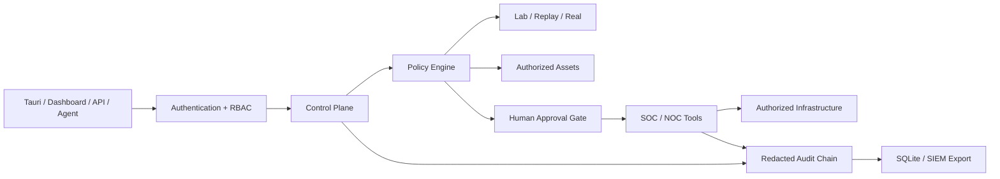

# Nexus Defense AI

**AI-assisted, policy-governed SOC/NOC platform for secure infrastructure operations.**

[](https://github.com/undereis/nexus-defense-ai/actions/workflows/ci.yml)

Nexus Defense AI is a private R&D platform that brings security monitoring,
network operations, incident response, threat intelligence, and AI-assisted
analysis into one governed control plane. It is designed around a simple rule:
high-impact actions must be authorized, policy-checked, auditable, and safe by
default.

> **Project status:** controlled prototype (`v0.1.x`). It is suitable for labs,
> demonstrations, and authorized testing. It is not presented as a finished or
> independently certified production security product.

## Why Nexus

- **Governed actions:** deterministic policy engine, RBAC, asset authorization,
  operational modes, and human approval for sensitive operations.
- **SOC + NOC context:** monitoring, incidents, infrastructure health, billing,
  device workflows, threat intelligence, deception, and response playbooks.
- **Auditable by design:** redaction, chained audit events, and optional HMAC
  signatures.
- **Safe operating modes:** the backend starts in `lab`; `replay` is available
  for historical analysis, while `real` must be selected deliberately.
- **Multiple interfaces:** FastAPI backend, embedded dashboard, natural-language
  agent, and a Tauri + React desktop client.
- **Security-focused delivery:** pinned dependencies, automated tests, linting,
  frontend build checks, Rust checks, dependency updates, and secret-safe CI.

## Architecture



The control plane is the decision boundary. Requests are evaluated for identity,
permission, target authorization, risk, and operating mode before a tool can
change state. See [Architecture](ARCHITECTURE.md) and
[Control Plane](docs/control_plane.md) for the detailed design.

## Quick start (safe local lab)

Requirements: macOS or Linux, Python 3.14, and Node.js 20+ for the optional
desktop client.

```bash
git clone https://github.com/undereis/nexus-defense-ai.git
cd nexus-defense-ai
python3 -m venv venv
source venv/bin/activate
python -m pip install --upgrade pip
python -m pip install -r requirements.txt
install -m 600 .env.example .env
python scripts/nexus_secrets.py init-credential-key
```

Create an API token and store it in the OS secret backend without committing it:

```bash
python scripts/nexus_secrets.py set NEXUS_API_TOKEN
```

After migrating existing local secrets, remove their plaintext copies safely:

```bash
python scripts/nexus_secrets.py migrate
python scripts/nexus_secrets.py scrub-env --yes
```

Start the API only on the loopback interface:

```bash
uvicorn api.server:app --host 127.0.0.1 --port 8000
```

The server fails closed when `NEXUS_API_TOKEN` is missing. The example
configuration starts in `lab`, disables automatic external abuse reporting, and
does not enable high-impact capabilities.

### Desktop client

```bash
cd clients/tauri
npm ci
npm run build
```

The client accepts only `http://127.0.0.1:8000` or
`http://localhost:8000`. Its bearer token is kept in session storage rather than
persistent browser storage. See the [client guide](clients/tauri/README.md).

## Quality baseline

The repository currently includes more than 1,200 automated Python tests. CI
validates:

- Ruff static checks;
- the hermetic Pytest suite (external-network integrations are opt-in);
- pinned Python dependency vulnerabilities;
- npm dependency audit and production build;
- Rust/Tauri compilation with the committed lockfile.

Run the primary checks locally:

```bash
ruff check .
pytest -q
cd clients/tauri && npm ci && npm run build && cargo check --locked --manifest-path src-tauri/Cargo.toml
```

External integration checks can be run separately on a prepared host with
`pytest -q -m integration`.

## Repository map

| Path | Purpose |
| --- | --- |
| `api/` | Authenticated FastAPI interface |
| `agents/` | AI agent orchestration and runtime |
| `core/` | Policy, RBAC, operating mode, audit, and governance |
| `tools/` | SOC/NOC capabilities and integrations |
| `database/` | Local persistence and migrations |
| `clients/tauri/` | React + Tauri desktop client |
| `deploy/` | Narrowly scoped privileged installation assets |
| `tests/` | Security, policy, API, tool, and regression tests |
| `docs/` | API, architecture, operations, and integration guides |

## Safety and responsible use

Use Nexus only on systems and networks you own or are explicitly authorized to
test. Real-state changes require deliberate mode selection and may require human
approval. The macOS firewall integration uses a root-owned, input-validating
helper; install it once with `sudo deploy/install_firewall_helper.sh` only on an
authorized host.

Never commit `.env`, databases, tokens, customer data, captures, or operational
logs. Review [SECURITY.md](SECURITY.md) before exposing any service beyond a
local lab.

## Roadmap

- split the largest agent and database modules into bounded services;
- expand contract and integration tests around external providers;
- add PostgreSQL and managed secrets backends for multi-user deployments;
- formalize release artifacts, SBOM generation, and signed builds;
- complete an external security assessment before any production claim.

## Maintainer

Built by **Ramon Mascarenha Reis** at **NeuroForge Labs** — Cybersecurity & AI
Systems Architecture. Connect on
[LinkedIn](https://www.linkedin.com/in/ramon-reis-07358a79/).

## License

Nexus Defense AI is published as source-available portfolio software. Review
and security research are welcome, but copying, modification, distribution,
deployment, or commercial use requires prior written permission. See
[LICENSE](LICENSE).
